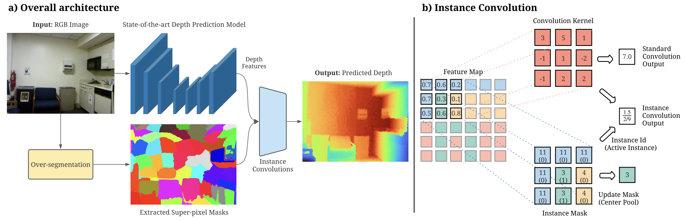
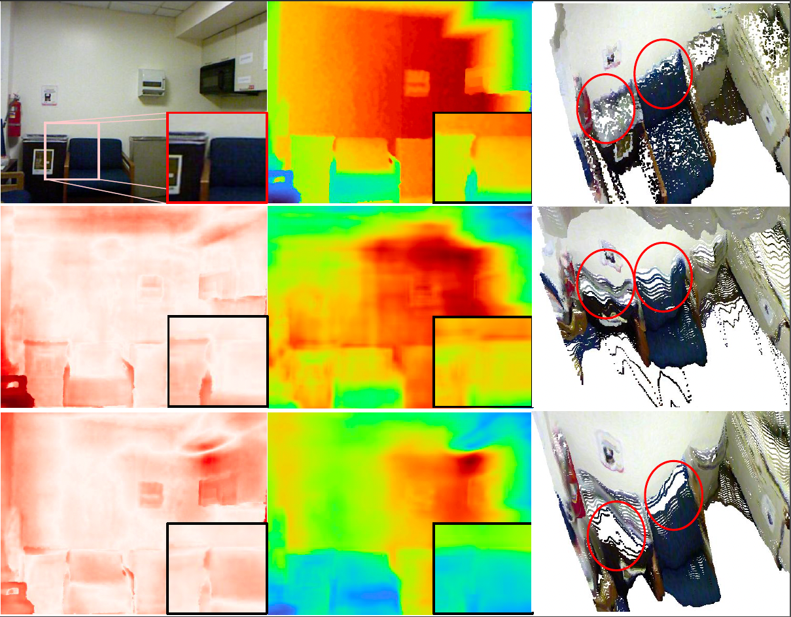

# Object-aware Monocular Depth Prediction with Instance Convolutions

We provide the official implementation of Instance Convolution (IC) in this repository. IC can be used with any state-of-the-art monocular depth prediction method to improve occlusion boundaries. 

> https://arxiv.org/abs/2112.01521  
> https://ieeexplore.ieee.org/document/9726910  


Instance Convolution aggregates features coming from the same segment as the center pixel with respect to the current kernel location:

<p align="center">
  
</p>

Improvement along the object boundaries can be illustrated on unprojected 3D point clouds and corresponding error maps:

<p align="center">
  
</p>


## Installation
PyTorch 1.5, torchvision and scikit-image.

## Run the example code 
``` bash
$ python vanilla_net.py
```
## Citation

If you use this code for your research, please cite our paper:
```
@article{simsar2021object,
  author={Simsar, Enis and {\"O}rnek, Evin P{\i}nar and Manhardt, Fabian and Dhamo, Helisa and Navab, Nassir and Tombari, Federico},
  journal={IEEE Robotics and Automation Letters}, 
  title={Object-Aware Monocular Depth Prediction With Instance Convolutions}, 
  year={2022},
  volume={7},
  number={2},
  pages={5389-5396},
  doi={10.1109/LRA.2022.3155823}
}

```
